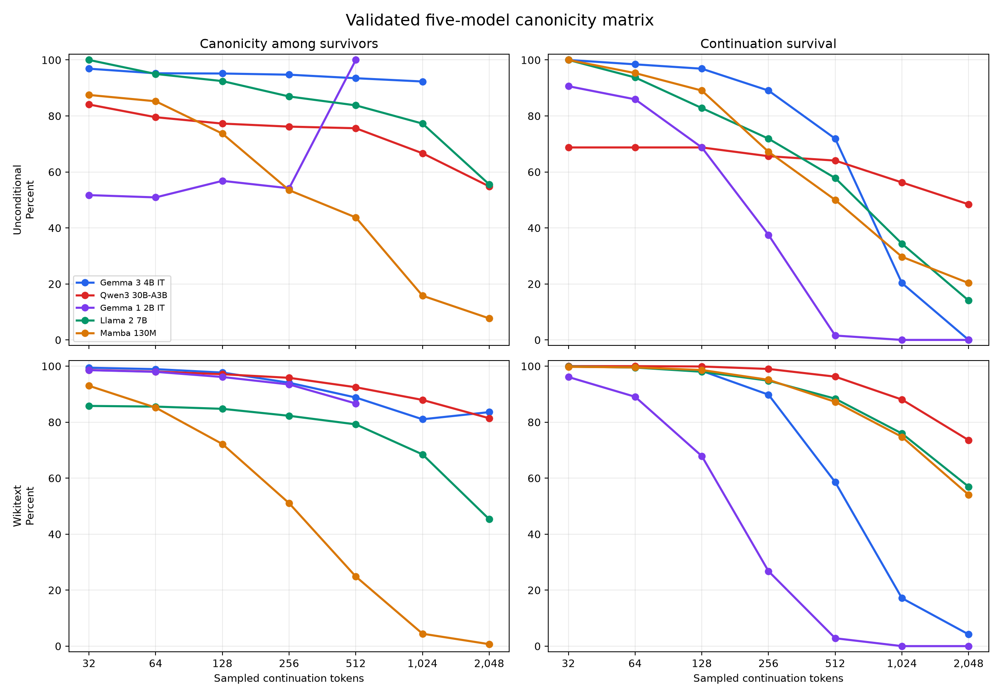
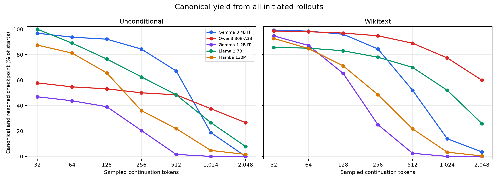
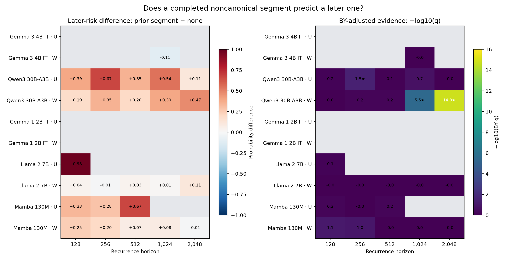
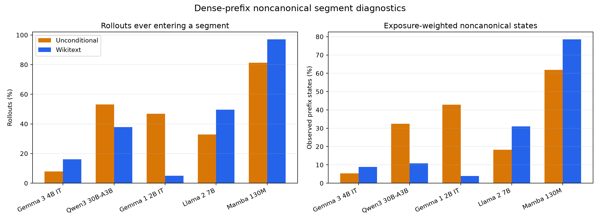

# Final canonicity-matrix report

The complete five-model × two-condition matrix has been validated with `canonicity-aggregate`. All 10 jobs have matching condition designs and artifact hashes. The aggregate contains 70 canonicity rows and the planned family of 50 recurrence hypotheses; 25 hypotheses were statistically testable and 25 were conservatively assigned multiplicity `p=1`.



## Executive findings

1. **Canonicity is strongly model- and context-dependent.** At 128 WikiText-conditioned tokens, survivor canonicity is 97.7% for Gemma 3 4B IT, 97.1% for Qwen, 96.1% for Gemma 1 2B IT, 84.8% for Llama 2, and 72.2% for Mamba. By 2,048 tokens, Mamba falls to 0.69%, Llama to 45.3%, Qwen to 81.4%, and Gemma 3 reports 83.6%; Gemma 1 has no survivors.
2. **Survival must accompany every canonicity result.** Gemma 3's nominally best 2,048-token WikiText score is based on only 67/1,600 surviving rollouts across 47 prompts. Qwen's slightly lower 81.4% is based on 1,177/1,600 survivors across all 100 prompts. Consequently, the fraction of all starts that both reach 2,048 and are canonical is 3.5% for Gemma 3 versus 59.9% for Qwen.
3. **Mamba has the clearest long-prefix degradation.** Its WikiText canonicity declines from 93.0% at 32 to 24.9% at 512, 4.43% at 1,024, and 0.69% at 2,048, despite more than half of rollouts reaching 2,048.
4. **Gemma 1's unconditional result is poor but off-template.** It is near 52–57% canonicity through 256 tokens, while raw WikiText raises it above 93% through 256. However, it terminates aggressively: no rollout in either condition reaches 1,024. The unconditional instruction-model condition is not normal assistant behavior.
5. **Llama 2 behaves differently under raw conditioning.** Its WikiText survivor canonicity is lower than unconditional at comparable checkpoints, but its conditioned survival is much stronger at long horizons. At 2,048, 911/1,600 conditioned rollouts survive versus 9/64 unconditional.
6. **There is adjusted evidence that Qwen deviations recur.** Three of the 50 planned recurrence hypotheses survive the dependence-robust Benjamini–Yekutieli correction: Qwen unconditional at horizon 256, and Qwen WikiText at horizons 1,024 and 2,048.
7. **The recurrence result is association, not causal “snowballing.”** It is conditional on reaching the horizon and being canonical at its halfway landmark. It shows that a completed earlier noncanonical segment identifies rollouts with higher later-segment risk; it does not prove the earlier deviation causes the later one.

## What is measured

At generated length `t`, a complete sampled prefix `v` is canonical exactly when:

```text
v == tokenizer.encode(tokenizer.decode(v))
```

The prompt or unconditional seed and terminating EOS are excluded. An individual token is not intrinsically canonical or noncanonical. The dense analysis instead labels each complete prefix and groups consecutive noncanonical prefix states into maximal **segments**.

The checkpoint percentage estimates:

```text
P(canonical at length L | rollout generated at least L continuation tokens)
```

It does not estimate the proportion of all initiated rollouts that remain both active and canonical. That joint quantity is reported separately as canonical yield.

## Cross-model checkpoint summary

### WikiText-conditioned

| Model | Canonical at 128 | Canonical at 512 | Canonical at 2,048 | Survived to 2,048 | Canonical yield at 2,048 |
|---|---:|---:|---:|---:|---:|
| Gemma 3 4B IT | 1,537/1,573 = 97.7% | 832/937 = 88.8% | 56/67 = 83.6% | 67/1,600 = 4.2% | 56/1,600 = 3.5% |
| Qwen3 30B-A3B | 1,552/1,598 = 97.1% | 1,424/1,540 = 92.5% | 958/1,177 = 81.4% | 1,177/1,600 = 73.6% | 958/1,600 = 59.9% |
| Gemma 1 2B IT | 1,044/1,086 = 96.1% | 39/45 = 86.7% | no survivors | 0/1,600 | 0% |
| Llama 2 7B | 1,329/1,568 = 84.8% | 1,120/1,414 = 79.2% | 413/911 = 45.3% | 911/1,600 = 56.9% | 413/1,600 = 25.8% |
| Mamba 130M | 1,139/1,578 = 72.2% | 347/1,396 = 24.9% | 6/865 = 0.69% | 865/1,600 = 54.1% | 6/1,600 = 0.38% |

### Unconditional

| Model | Canonical at 128 | Canonical at 512 | Canonical at 2,048 | Survived to 2,048 |
|---|---:|---:|---:|---:|
| Gemma 3 4B IT | 59/62 = 95.2% | 43/46 = 93.5% | no survivors | 0/64 |
| Qwen3 30B-A3B | 34/44 = 77.3% | 31/41 = 75.6% | 17/31 = 54.8% | 31/64 = 48.4% |
| Gemma 1 2B IT | 25/44 = 56.8% | 1/1 = 100% | no survivors | 0/64 |
| Llama 2 7B | 49/53 = 92.5% | 31/37 = 83.8% | 5/9 = 55.6% | 9/64 = 14.1% |
| Mamba 130M | 42/57 = 73.7% | 14/32 = 43.8% | 1/13 = 7.7% | 13/64 = 20.3% |

Gemma 1's 100% value at 512 is only 1/1 and should not be treated as a rebound. Likewise, the 2,048-token Llama/Gemma 3 ordering is not meaningful without its denominators.

## Canonical yield from all starts



Canonical yield is `canonical_sequences / total_started_rollouts`. It combines survival and conditional canonicity without treating early EOS as a tokenization failure. This view makes the long-horizon operational contrast especially clear:

- WikiText at 2,048: Qwen 59.9%, Llama 25.8%, Gemma 3 3.5%, Mamba 0.38%, Gemma 1 0%.
- Unconditional at 2,048: Qwen 26.6%, Llama 7.8%, Mamba 1.6%; both Gemmas 0%.

This is not a replacement for the primary canonicity estimand, because EOS behavior is a separate model property. It is a necessary companion view.

## Does a prior deviation predict a later deviation?



For each horizon `H`, the recurrence analysis:

1. keeps rollouts that reached `H` and are canonical at landmark `H/2`;
2. marks exposure when at least one noncanonical segment completed before the landmark;
3. marks outcome when a new segment starts after the landmark through `H`;
4. compares exposed and unexposed rollouts using Fisher's exact test for unconditional runs or an exact prompt-stratified conditional test for WikiText;
5. corrects the predeclared 50-test family with Benjamini–Yekutieli FDR control.

### Adjusted discoveries

| Model/condition | Horizon | Later risk after prior segment | Later risk without prior segment | Risk difference | Common OR | Raw p | BY q |
|---|---:|---:|---:|---:|---:|---:|---:|
| Qwen unconditional | 256 | 8/10 = 80.0% | 3/23 = 13.0% | +67.0 pp | 26.67 | 4.25×10⁻⁴ | 0.0319 |
| Qwen WikiText | 1,024 | 32/62 = 51.6% | 157/1,243 = 12.6% | +39.0 pp | 4.36 | 2.88×10⁻⁸ | 3.24×10⁻⁶ |
| Qwen WikiText | 2,048 | 83/123 = 67.5% | 185/913 = 20.3% | +47.2 pp | 6.30 | 7.08×10⁻¹⁸ | 1.59×10⁻¹⁵ |

The WikiText probabilities are descriptive pooled risks; the reported common odds ratios and exact tests adjust for prompt strata. At horizon 2,048, 1,177 rollouts survived, 141 were excluded because they were noncanonical at the 1,024 landmark, and 1,036 entered the recurrence risk set.

Several other rows have raw `p<0.05`—including Qwen at shorter horizons, Mamba, and Llama—but do not survive the planned correction. No adjusted recurrence finding is present for either Gemma, Llama, or Mamba.

Interpretation: Qwen shows robust **recurrence association**, especially in long WikiText continuations. The analysis does not distinguish a causal memory effect from persistent latent rollout properties such as text domain, token patterns, or generation mode.

## Dense-prefix segment behavior



| Model | Any segment, unconditional | Any segment, WikiText | Noncanonical states, unconditional | Noncanonical states, WikiText |
|---|---:|---:|---:|---:|
| Gemma 3 4B IT | 7.8% | 16.1% | 5.4% | 8.8% |
| Qwen3 30B-A3B | 53.1% | 37.8% | 32.4% | 10.8% |
| Gemma 1 2B IT | 46.9% | 5.1% | 42.9% | 3.9% |
| Llama 2 7B | 32.8% | 49.6% | 18.2% | 30.9% |
| Mamba 130M | 81.2% | 97.1% | 61.8% | 78.6% |

Qwen WikiText is notable: 37.8% of rollouts enter at least one segment, yet only 10.8% of observed prefix states are noncanonical. Among affected rollouts, the median longest segment is only two prefix states, although the distribution has a very long tail. This is consistent with frequent short deviations that can recur. Mamba's deviations are much more persistent: 78.6% of its observed conditioned prefix states are noncanonical.

Segment incidence and lifetime counts remain exposure-confounded because longer rollouts have more opportunities to enter a segment. The recurrence risk-set design handles exposure more carefully than raw lifetime counts.

## Experimental and inferential caveats

- The realized design is 64 unconditional rollouts per model and 16 rollouts for each of 100 WikiText prompts. This differs from the checked-in prose that describes 32 and 64 respectively. The aggregator confirms cross-model pairing under the realized design, but the documentation mismatch should be corrected.
- The four Transformer runs use exact checkpoint-native precision and FlashAttention 2; Mamba is FP32 and attention-free. Architecture, weights, tokenizer, precision, and generated text are inseparable parts of each model condition.
- WikiText uses the same raw article-prefix text across models, but each tokenizer sees a different prompt-token length. Instruction-tuned models are not given chat templates.
- Pooled WikiText canonicity percentages are descriptive. The 16 rollouts within each prompt are clustered, so they do not justify an iid-rollout interval for the prompt population.
- Canonicity is not monotone. A longer prefix can return to canonical state when a byte sequence or merge boundary is completed.
- Recurrence tests condition on survival to `H` and canonical state at `H/2`; conclusions do not automatically generalize to early-terminated or landmark-noncanonical rollouts.

## Validated and generated artifacts

Validated aggregate outputs:

- `results/model-matrix/canonicity_all.csv`
- `results/model-matrix/recurrence_all.csv`
- `results/model-matrix/recurrence_all.metadata.json`

Report outputs:

- `matrix_overview.png`, `canonical_yield.png`, `recurrence_heatmaps.png`, and `segment_summary.png`
- `checkpoint_summary.csv`, `segment_summary.csv`, and `prompt_survival_summary.csv`
- `adjusted_recurrence_discoveries.csv`
- `analyze_matrix.py`, which regenerates the report figures and derived tables from the validated aggregate
