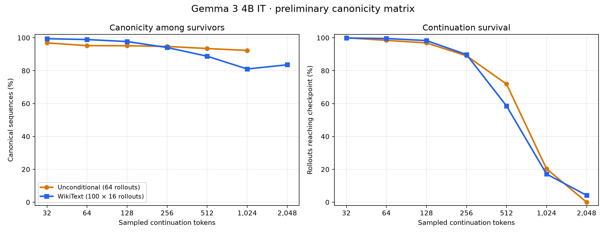
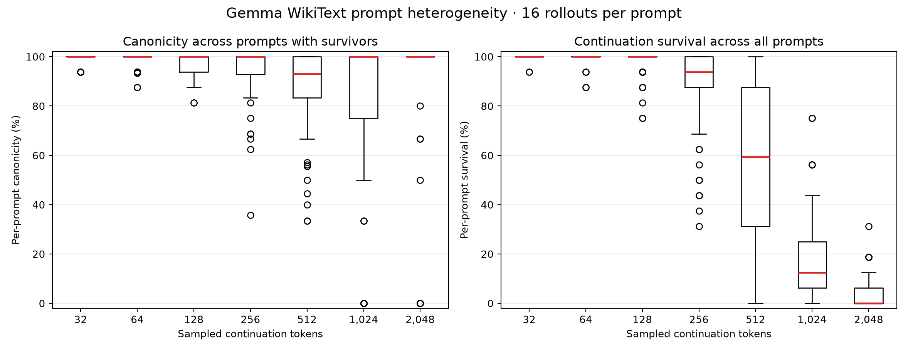
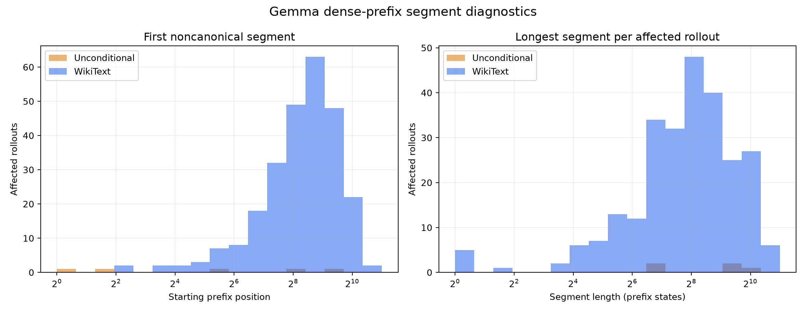

# Preliminary Gemma 3 4B IT canonicity report

This report covers the two completed `google/gemma-3-4b-it` arms only. It does not use or wait for the active Qwen run.

## Headline findings

- **Gemma is highly canonical at short lengths in both conditions.** At 32 continuation tokens, 62/64 unconditional survivors are canonical (96.9%), versus 1,589/1,598 WikiText-conditioned survivors (99.4%).
- **The WikiText advantage is early, not uniformly persistent.** Relative to unconditional, the pooled conditioned score is +2.6 percentage points at 32 tokens, +3.7 at 64, and +2.6 at 128. It is -0.7 at 256, -4.7 at 512, and -11.3 at 1,024. These are descriptive differences, not a randomized or cluster-adjusted condition test.
- **EOS survival dominates the long-horizon interpretation.** Unconditional survival falls from 64/64 at 32 to 13/64 at 1,024 and 0/64 at 2,048. WikiText survival falls from 1,598/1,600 at 32 to 274/1,600 at 1,024 and 67/1,600 at 2,048.
- **The apparent WikiText rebound at 2,048 is survivor selection.** Canonicity rises from 81.0% at 1,024 to 83.6% at 2,048, but the denominator shrinks from 274 to 67 rollouts. At 2,048, 53 of 100 prompts have no survivor at all.
- **Prompt effects become substantial after 256 tokens.** At 512, per-prompt survival has median 59.4% and IQR 31.2–87.5%; among the 98 prompts with survivors, canonicity has median 93.1% and IQR 83.3–100%. At 1,024, only 85 prompts have survivors and their per-prompt canonicity ranges from 0% to 100%.
- **Dense-prefix deviations are uncommon but often long.** A noncanonical segment occurs in 5/64 unconditional rollouts (7.8%) and 258/1,600 conditioned rollouts (16.1%). Every affected unconditional rollout has exactly one segment; conditioned rollouts have 263 total segments, with at most four in one rollout.
- **There is no useful Gemma recurrence signal yet.** The unconditional recurrence tables have no informative exposed group. WikiText has only one technically informative stratum at horizon 1,024, with odds ratio 0 and exact p=1.0.

## Score and survival table

The score is exact whole-prefix equality between sampled token IDs and `encode(decode(ids))`. Prompt tokens and the terminating EOS are excluded. Each canonicity denominator contains only rollouts that reach that checkpoint.

| Tokens | Uncond. canonical | Uncond. survival | WikiText canonical | WikiText survival |
|---:|---:|---:|---:|---:|
| 32 | 62/64 = 96.9% | 64/64 = 100.0% | 1,589/1,598 = 99.4% | 1,598/1,600 = 99.9% |
| 64 | 60/63 = 95.2% | 63/64 = 98.4% | 1,576/1,593 = 98.9% | 1,593/1,600 = 99.6% |
| 128 | 59/62 = 95.2% | 62/64 = 96.9% | 1,537/1,573 = 97.7% | 1,573/1,600 = 98.3% |
| 256 | 54/57 = 94.7% | 57/64 = 89.1% | 1,352/1,437 = 94.1% | 1,437/1,600 = 89.8% |
| 512 | 43/46 = 93.5% | 46/64 = 71.9% | 832/937 = 88.8% | 937/1,600 = 58.6% |
| 1,024 | 12/13 = 92.3% | 13/64 = 20.3% | 222/274 = 81.0% | 274/1,600 = 17.1% |
| 2,048 | no survivors | 0/64 = 0.0% | 56/67 = 83.6% | 67/1,600 = 4.2% |

The unconditional 1,024-token Wilson 95% interval is very wide: 66.7–98.6%. The pooled WikiText rows intentionally have no iid-rollout interval because rollouts are clustered within 100 prompts.

## Prompt heterogeneity

| Tokens | Prompts with survivors | All survivors canonical | Canonicity median (IQR) | Survival median (IQR) |
|---:|---:|---:|---:|---:|
| 32 | 100 | 91 | 100% (100–100%) | 100% (100–100%) |
| 64 | 100 | 85 | 100% (100–100%) | 100% (100–100%) |
| 128 | 100 | 73 | 100% (93.8–100%) | 100% (100–100%) |
| 256 | 100 | 54 | 100% (92.9–100%) | 93.8% (87.5–100%) |
| 512 | 98 | 45 | 93.1% (83.3–100%) | 59.4% (31.2–87.5%) |
| 1,024 | 85 | 51 | 100% (75–100%) | 12.5% (6.2–25%) |
| 2,048 | 47 | 38 | 100% (100–100%) | 0% (0–6.2%) |

Long-horizon prompt medians can look better than the pooled rate because many prompts contribute only one or a few survivors. A 100% prompt value may mean 1/1 rather than 16/16.

## Dense-prefix segment diagnostics

| Condition | Rollouts with a segment | Total segments | Noncanonical prefix states | Median longest segment | Maximum segment |
|---|---:|---:|---:|---:|---:|
| Unconditional | 5/64 = 7.8% | 5 | 2,483/46,116 = 5.38% | 536 | 1,037 |
| WikiText | 258/1,600 = 16.1% | 263 | 97,421/1,104,238 = 8.82% | 245.5 | 1,954 |

These dense-prefix quantities are diagnostics, not the primary checkpoint metric. Lifetime segment counts are exposure-confounded: longer rollouts have more opportunities to enter a segment.

## Provenance and caveats

Both arms use Gemma commit `093f9f388b31de276ce2de164bdc2081324b9767`, the matching tokenizer commit, BF16 parameters, native FlashAttention 2.6.3, full-distribution sampling, seed 0, and an A100 80 GB GPU. WikiText uses 100 raw article-prefix contexts with 16 rollouts each; unconditional uses 64 rollouts and no chat template.

Important limitations:

1. Unconditional instruction-model sampling is off-template self-sampling, not ordinary assistant behavior.
2. Realized counts (64 unconditional; 16 per prompt) differ from the checked-in planned prose (32; 64 per prompt).
3. Conditional pooled percentages are descriptive because rollouts are clustered by prompt and EOS is prompt-dependent.
4. Output distribution and tokenizer are jointly involved; this is not a tokenizer-only comparison.
5. Multiplicity-adjusted recurrence claims require all ten planned arms.

## Artifacts

- `gemma_overview.png`: checkpoint canonicity and survival.
- `gemma_prompt_heterogeneity.png`: prompt-level distributions.
- `gemma_segments.png`: segment-position and length distributions.
- `gemma_checkpoint_summary.csv`, `gemma_prompt_dispersion.csv`, and `gemma_segment_summary.csv`: source values.
- `gemma_provenance.json`: sampling-plan identities.
- `analyze_gemma.py`: reproducible generator that reads completed Gemma artifacts only.
